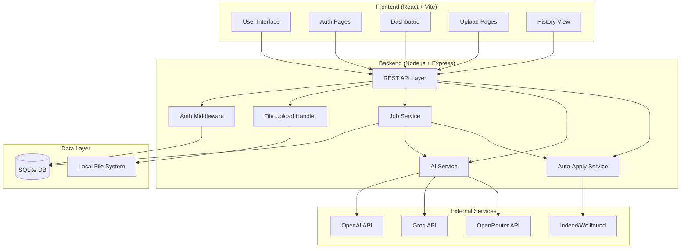

# Design Document

## Overview

The Job Application Automation System is a full-stack application that runs entirely on a user's local machine. It consists of a Node.js/Express backend with SQLite database, a React/Vite/Tailwind frontend, and Playwright-based automation for web scraping and form submission. The system integrates with AI services (OpenAI, Groq, or OpenRouter) to intelligently tailor resumes to job descriptions.

### Technology Stack

**Backend:**
- Node.js + Express.js
- SQLite (better-sqlite3)
- JWT for authentication
- bcrypt for password hashing
- Multer for file uploads
- Playwright for web automation

**Frontend:**
- React 18
- Vite
- Tailwind CSS
- Axios for API calls
- React Router for navigation

**AI Integration:**
- OpenAI API (GPT-4o-mini)
- Groq API
- OpenRouter API

## Architecture

### High-Level Architecture



### Directory Structure

```
job-application-automation/
├── backend/
│   ├── server.js                 # Main Express server
│   ├── config/
│   │   ├── database.js           # SQLite connection
│   │   └── multer.js             # File upload configuration
│   ├── middleware/
│   │   └── auth.js               # JWT authentication middleware
│   ├── routes/
│   │   ├── auth.js               # Authentication routes
│   │   ├── user.js               # User profile routes
│   │   ├── upload.js             # File upload routes
│   │   └── job.js                # Job application routes
│   ├── services/
│   │   ├── ai.service.js         # AI integration service
│   │   ├── scraper.service.js    # Job scraping with Playwright
│   │   └── autoapply.service.js  # Auto-apply with Playwright
│   ├── models/
│   │   └── schema.js             # Database schema initialization
│   ├── uploads/
│   │   ├── resumes/
│   │   ├── tailored/
│   │   └── documents/
│   ├── database.db               # SQLite database file
│   ├── package.json
│   └── .env
│
├── frontend/
│   ├── src/
│   │   ├── App.jsx
│   │   ├── main.jsx
│   │   ├── pages/
│   │   │   ├── Register.jsx
│   │   │   ├── Login.jsx
│   │   │   ├── Dashboard.jsx
│   │   │   ├── UploadResume.jsx
│   │   │   ├── ApplyJob.jsx
│   │   │   ├── ApplicationHistory.jsx
│   │   │   └── Settings.jsx
│   │   ├── components/
│   │   │   ├── Navbar.jsx
│   │   │   ├── ProtectedRoute.jsx
│   │   │   └── LoadingSpinner.jsx
│   │   ├── services/
│   │   │   └── api.js            # Axios API client
│   │   └── utils/
│   │       └── auth.js           # Auth helper functions
│   ├── index.html
│   ├── package.json
│   ├── vite.config.js
│   └── tailwind.config.js
│
└── README.md
```

## Components and Interfaces

### Backend Components

#### 1. Express Server (server.js)

**Responsibilities:**
- Initialize Express application
- Configure middleware (CORS, JSON parsing, file uploads)
- Mount route handlers
- Start HTTP server
- Initialize database on startup

**Key Dependencies:**
- express
- cors
- better-sqlite3
- dotenv

#### 2. Database Configuration (config/database.js)

**Responsibilities:**
- Create SQLite connection
- Initialize database schema
- Provide database instance to other modules

**Schema Tables:**
```sql
-- users table
CREATE TABLE IF NOT EXISTS users (
    id INTEGER PRIMARY KEY AUTOINCREMENT,
    name TEXT NOT NULL,
    email TEXT UNIQUE NOT NULL,
    password_hash TEXT NOT NULL,
    resume_path TEXT,
    profile_data TEXT,
    created_at DATETIME DEFAULT CURRENT_TIMESTAMP
);

-- job_applications table
CREATE TABLE IF NOT EXISTS job_applications (
    id INTEGER PRIMARY KEY AUTOINCREMENT,
    user_id INTEGER NOT NULL,
    job_link TEXT NOT NULL,
    job_description TEXT,
    tailored_resume_path TEXT,
    status TEXT DEFAULT 'applied',
    applied_at DATETIME DEFAULT CURRENT_TIMESTAMP,
    FOREIGN KEY (user_id) REFERENCES users(id)
);

-- documents table
CREATE TABLE IF NOT EXISTS documents (
    id INTEGER PRIMARY KEY AUTOINCREMENT,
    user_id INTEGER NOT NULL,
    file_path TEXT NOT NULL,
    file_type TEXT NOT NULL,
    uploaded_at DATETIME DEFAULT CURRENT_TIMESTAMP,
    FOREIGN KEY (user_id) REFERENCES users(id)
);
```

#### 3. Multer Configuration (config/multer.js)

**Responsibilities:**
- Configure file upload destinations
- Set file naming conventions
- Validate file types and sizes

**Storage Destinations:**
- Resumes: `uploads/resumes/`
- Tailored resumes: `uploads/tailored/`
- Documents: `uploads/documents/`

**File Naming:**
- Format: `{userId}_{timestamp}_{originalname}`

#### 4. Authentication Middleware (middleware/auth.js)

**Responsibilities:**
- Verify JWT tokens from request headers
- Extract user ID from token
- Attach user information to request object
- Return 401 for invalid/missing tokens

**Interface:**
```javascript
function authenticateToken(req, res, next)
// Input: req.headers.authorization = "Bearer <token>"
// Output: req.user = { userId, email }
// Errors: 401 Unauthorized
```

#### 5. AI Service (services/ai.service.js)

**Responsibilities:**
- Interface with multiple AI providers (OpenAI, Groq, OpenRouter)
- Extract skills from job descriptions
- Generate tailored resumes
- Format output as ATS-friendly text

**Key Functions:**
```javascript
async function tailorResume(originalResume, jobDescription, provider)
// Input: resume text, job description, AI provider name
// Output: tailored resume text
// Errors: API errors, network errors

async function extractSkills(jobDescription, provider)
// Input: job description text, AI provider name
// Output: array of required skills
// Errors: API errors, parsing errors
```

**AI Prompt Strategy:**
```
System: You are an expert resume writer specializing in ATS optimization.

User: Given this job description:
{jobDescription}

And this resume:
{originalResume}

Tailor the resume to emphasize relevant skills and experience for this position. 
Maintain the original structure but rewrite bullet points to match job requirements.
Use keywords from the job description naturally.
Keep it concise and ATS-friendly.
```

#### 6. Scraper Service (services/scraper.service.js)

**Responsibilities:**
- Launch headless browser with Playwright
- Navigate to job posting URLs
- Extract job description text
- Handle different site structures (Indeed, Wellfound)
- Implement retry logic for failed scrapes

**Key Functions:**
```javascript
async function scrapeJobDescription(jobUrl)
// Input: job posting URL
// Output: { title, company, description, requirements }
// Errors: timeout, invalid URL, scraping failures
```

**Site-Specific Selectors:**
- Indeed: `.jobsearch-jobDescriptionText`
- Wellfound: `[data-test="JobDescription"]`

#### 7. Auto-Apply Service (services/autoapply.service.js)

**Responsibilities:**
- Launch browser with Playwright
- Navigate to application pages
- Fill form fields with user data
- Upload tailored resume
- Submit application
- Capture confirmation or errors

**Key Functions:**
```javascript
async function applyToIndeed(jobUrl, userData, resumePath)
// Input: job URL, user profile data, resume file path
// Output: { success: boolean, message: string }
// Errors: form validation, upload failures, submission errors

async function applyToWellfound(jobUrl, userData, resumePath)
// Input: job URL, user profile data, resume file path
// Output: { success: boolean, message: string }
// Errors: authentication required, form errors
```

### Frontend Components

#### 1. App Component (App.jsx)

**Responsibilities:**
- Set up React Router
- Define application routes
- Provide global state/context if needed

**Routes:**
- `/` → Landing/Login
- `/register` → Registration page
- `/login` → Login page
- `/dashboard` → Protected dashboard
- `/upload-resume` → Protected upload page
- `/apply-job` → Protected job application page
- `/history` → Protected application history
- `/settings` → Protected settings page

#### 2. Authentication Pages

**Register.jsx:**
- Form fields: name, email, password, confirm password
- Validation: email format, password strength, matching passwords
- API call: POST /register
- Redirect to login on success

**Login.jsx:**
- Form fields: email, password
- API call: POST /login
- Store JWT token in localStorage
- Redirect to dashboard on success

#### 3. Dashboard (Dashboard.jsx)

**Responsibilities:**
- Display user profile summary
- Show recent applications
- Quick action buttons (upload resume, apply to job)
- Statistics: total applications, success rate

#### 4. Upload Resume (UploadResume.jsx)

**Responsibilities:**
- File input for resume upload
- Preview uploaded file name
- API call: POST /upload-resume
- Display success/error messages

#### 5. Apply Job (ApplyJob.jsx)

**Responsibilities:**
- Input field for job URL
- Button to extract job description
- Display extracted job description
- Button to tailor resume
- Display tailored resume preview
- Button to auto-apply
- Progress indicators for each step

**Workflow:**
1. User enters job URL
2. Click "Extract Description" → calls backend scraper
3. Display job description
4. Click "Tailor Resume" → calls AI service
5. Display tailored resume
6. Click "Apply" → triggers auto-apply service
7. Show confirmation or error

#### 6. Application History (ApplicationHistory.jsx)

**Responsibilities:**
- Fetch and display all applications
- Table columns: Date, Company, Position, Status, Actions
- Filter by status
- View tailored resume for each application

#### 7. API Service (services/api.js)

**Responsibilities:**
- Configure Axios instance with base URL
- Attach JWT token to all requests
- Handle common errors (401, 500)
- Provide typed API methods

**Interface:**
```javascript
const api = {
  register: (name, email, password) => POST /register,
  login: (email, password) => POST /login,
  getUser: () => GET /get-user,
  uploadResume: (file) => POST /upload-resume,
  uploadDocument: (file, type) => POST /upload-document,
  applyJob: (jobUrl) => POST /apply-job,
  getApplicationHistory: () => GET /application-history
}
```

## Data Models

### User Model

```javascript
{
  id: number,
  name: string,
  email: string,
  password_hash: string,
  resume_path: string | null,
  profile_data: {
    phone: string,
    location: string,
    skills: string[],
    experience: Array<{
      title: string,
      company: string,
      duration: string,
      description: string
    }>,
    education: Array<{
      degree: string,
      institution: string,
      year: string
    }>
  },
  created_at: string
}
```

### Job Application Model

```javascript
{
  id: number,
  user_id: number,
  job_link: string,
  job_description: string,
  tailored_resume_path: string,
  status: 'applied' | 'error',
  applied_at: string
}
```

### Document Model

```javascript
{
  id: number,
  user_id: number,
  file_path: string,
  file_type: 'certificate' | 'other',
  uploaded_at: string
}
```

## Error Handling

### Backend Error Handling Strategy

1. **Validation Errors (400)**
   - Missing required fields
   - Invalid email format
   - File type not allowed

2. **Authentication Errors (401)**
   - Invalid credentials
   - Expired JWT token
   - Missing authorization header

3. **Not Found Errors (404)**
   - User not found
   - File not found
   - Application record not found

4. **Server Errors (500)**
   - Database errors
   - File system errors
   - AI API failures
   - Playwright automation failures

**Error Response Format:**
```javascript
{
  error: string,
  message: string,
  details?: any
}
```

### Frontend Error Handling

1. **Network Errors**
   - Display toast notification
   - Retry button for failed requests

2. **Validation Errors**
   - Inline form validation
   - Error messages below input fields

3. **Authentication Errors**
   - Redirect to login page
   - Clear stored token

4. **API Errors**
   - Display error message from backend
   - Log errors to console for debugging

## Testing Strategy

### Backend Testing

1. **Unit Tests**
   - AI service functions
   - Authentication middleware
   - Database operations

2. **Integration Tests**
   - API endpoint testing
   - File upload workflows
   - Job application workflow end-to-end

3. **Automation Tests**
   - Scraper service with mock pages
   - Auto-apply service with test forms

**Testing Tools:**
- Jest for unit tests
- Supertest for API testing
- Playwright Test for automation testing

### Frontend Testing

1. **Component Tests**
   - Form validation
   - Button interactions
   - Navigation flows

2. **Integration Tests**
   - API integration
   - Authentication flow
   - Complete job application workflow

**Testing Tools:**
- Vitest for unit tests
- React Testing Library for component tests
- Playwright for E2E tests

### Manual Testing Checklist

- [ ] User registration and login
- [ ] Resume upload and storage
- [ ] Job description extraction from Indeed
- [ ] Job description extraction from Wellfound
- [ ] AI resume tailoring with each provider
- [ ] Auto-apply to Indeed
- [ ] Auto-apply to Wellfound
- [ ] Application history display
- [ ] File download from history

## Security Considerations

1. **Password Security**
   - Use bcrypt with salt rounds = 10
   - Never log or expose passwords

2. **JWT Security**
   - Use strong secret key (256-bit)
   - Set reasonable expiration (24 hours)
   - Validate token on every protected route

3. **File Upload Security**
   - Validate file types (whitelist: .pdf, .docx)
   - Limit file size (max 10MB)
   - Sanitize file names
   - Store files outside web root

4. **API Key Security**
   - Store in .env file
   - Never commit .env to version control
   - Validate API keys on startup

5. **SQL Injection Prevention**
   - Use parameterized queries
   - Validate and sanitize all inputs

6. **XSS Prevention**
   - Sanitize user inputs in frontend
   - Use React's built-in XSS protection

## Performance Considerations

1. **Database Optimization**
   - Index on user_id in job_applications and documents tables
   - Index on email in users table
   - Use prepared statements for repeated queries

2. **File Storage**
   - Implement file size limits
   - Consider cleanup strategy for old tailored resumes

3. **AI API Optimization**
   - Cache job description summaries
   - Implement rate limiting
   - Use streaming responses for large outputs

4. **Playwright Optimization**
   - Reuse browser contexts when possible
   - Set reasonable timeouts (30 seconds)
   - Implement headless mode for production

## Deployment and Setup

### Local Development Setup

1. **Prerequisites:**
   - Node.js 18+
   - npm or yarn

2. **Backend Setup:**
   ```bash
   cd backend
   npm install
   # Create .env file with API keys
   npm run dev
   ```

3. **Frontend Setup:**
   ```bash
   cd frontend
   npm install
   npm run dev
   ```

4. **Environment Variables:**
   ```
   # Backend .env
   PORT=5000
   JWT_SECRET=your-secret-key-here
   OPENAI_API_KEY=your-openai-key
   GROQ_API_KEY=your-groq-key
   OPENROUTER_API_KEY=your-openrouter-key
   AI_PROVIDER=openai  # or groq, openrouter
   ```

### Production Considerations

1. **Database Backup**
   - Implement periodic SQLite backup
   - Store backups in separate directory

2. **Logging**
   - Use winston or pino for structured logging
   - Log all application errors
   - Log job application attempts

3. **Monitoring**
   - Track API success/failure rates
   - Monitor file storage usage
   - Alert on repeated automation failures

## Future Enhancements

1. **Additional Job Platforms**
   - Support for more job sites
   - Configurable platform adapters

2. **Advanced AI Features**
   - Cover letter generation
   - Interview preparation
   - Skill gap analysis

3. **Analytics Dashboard**
   - Application success metrics
   - Response rate tracking
   - A/B testing for resume variations

4. **Database Migration**
   - Easy migration path to PostgreSQL/MySQL
   - Export/import functionality

5. **Browser Extension**
   - One-click apply from job pages
   - Automatic form detection
