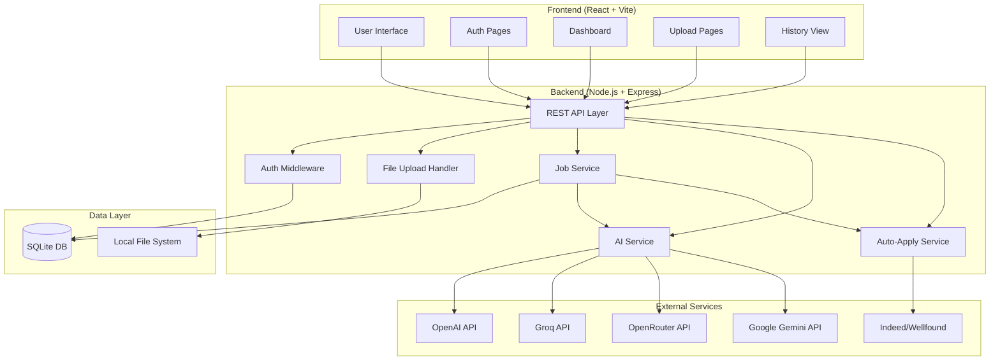

# Job Application Automation System

A local-only job application automation system that helps you manage professional documents, automatically tailor resumes to job descriptions using AI, and submit applications to job platforms (Indeed, Wellfound) with automated form filling.

## 🌟 Features

- **Local-First Architecture**: All data stored locally on your machine using SQLite
- **AI-Powered Resume Tailoring**: Automatically customize resumes for specific job descriptions
- **Multi-Provider AI Support**: Choose from OpenAI, Groq, OpenRouter, or Google Gemini
- **Automated Job Scraping**: Extract job descriptions from Indeed and Wellfound
- **Auto-Apply Functionality**: Automatically fill and submit job applications
- **Application History Tracking**: Keep track of all your job applications
- **Secure Authentication**: JWT-based authentication with bcrypt password hashing
- **Modern Web Interface**: React-based UI with Tailwind CSS

## 📋 Table of Contents

- [Architecture](#architecture)
- [Prerequisites](#prerequisites)
- [Installation](#installation)
- [Environment Variables](#environment-variables)
- [Usage Guide](#usage-guide)
- [API Endpoints](#api-endpoints)
- [Troubleshooting](#troubleshooting)
- [Project Structure](#project-structure)
- [Technology Stack](#technology-stack)

## 🏗️ Architecture



The system follows a three-tier architecture:
1. **Frontend Layer**: React-based SPA with Tailwind CSS
2. **Backend Layer**: Express.js REST API with Playwright automation
3. **Data Layer**: SQLite database and local file system storage

## 📦 Prerequisites

Before installing, ensure you have the following installed on your system:

- **Node.js** (v18 or higher) - [Download](https://nodejs.org/)
- **npm** (comes with Node.js) or **yarn**
- **Git** (optional, for cloning the repository)

## 🚀 Installation

### 1. Clone or Download the Project

```bash
git clone <repository-url>
cd job-application-automation
```

### 2. Backend Setup

```bash
# Navigate to backend directory
cd backend

# Install dependencies
npm install

# Create environment file
cp .env.example .env

# Edit .env file with your API keys (see Environment Variables section)
```

### 3. Frontend Setup

```bash
# Navigate to frontend directory (from project root)
cd frontend

# Install dependencies
npm install

# Create environment file
cp .env.example .env

# The default configuration should work for local development
```

### 4. Initialize Database

The database will be automatically created when you first start the backend server. The SQLite database file will be created at `backend/database.db`.

## 🔐 Environment Variables

### Backend Environment Variables

Create a `backend/.env` file with the following variables:

```env
# Server Configuration
PORT=5000

# JWT Secret (generate a strong random string)
JWT_SECRET=your-super-secret-jwt-key-change-this-in-production

# AI Provider Selection (choose one: openai, groq, openrouter, gemini)
AI_PROVIDER=openai

# OpenAI Configuration (if using OpenAI)
OPENAI_API_KEY=sk-your-openai-api-key-here

# Groq Configuration (if using Groq)
GROQ_API_KEY=your-groq-api-key-here

# OpenRouter Configuration (if using OpenRouter)
OPENROUTER_API_KEY=your-openrouter-api-key-here

# Google Gemini Configuration (if using Gemini)
GEMINI_API_KEY=your-gemini-api-key-here
```

### Frontend Environment Variables

Create a `frontend/.env` file:

```env
# Backend API URL
VITE_API_URL=http://localhost:5000/api
```

### Getting API Keys

- **OpenAI**: Sign up at [platform.openai.com](https://platform.openai.com/)
- **Groq**: Sign up at [console.groq.com](https://console.groq.com/)
- **OpenRouter**: Sign up at [openrouter.ai](https://openrouter.ai/)
- **Google Gemini**: Get API key from [Google AI Studio](https://makersuite.google.com/app/apikey)

## 📖 Usage Guide

### Starting the Application

#### Option 1: Run Backend and Frontend Separately

**Terminal 1 - Backend:**
```bash
cd backend
npm run dev
```
The backend will start on `http://localhost:5000`

**Terminal 2 - Frontend:**
```bash
cd frontend
npm run dev
```
The frontend will start on `http://localhost:5173`

#### Option 2: Run Both Concurrently (if configured)

```bash
# From project root
npm run dev
```

### Step-by-Step Usage

#### 1. Create an Account

1. Open your browser and navigate to `http://localhost:5173`
2. Click "Register" or navigate to `/register`
3. Fill in your details:
   - Name
   - Email
   - Password
   - Confirm Password
4. Click "Register"
5. You'll be redirected to the login page

#### 2. Login

1. Enter your email and password
2. Click "Login"
3. You'll be redirected to the dashboard

#### 3. Upload Your Resume

1. Navigate to "Upload Resume" from the dashboard or navbar
2. Click "Choose File" and select your resume (PDF or DOCX)
3. Click "Upload"
4. Your resume will be stored locally and associated with your account

#### 4. Apply to a Job

1. Navigate to "Apply to Job" from the dashboard or navbar
2. Paste a job URL from Indeed or Wellfound
3. Click "Extract Description" - the system will scrape the job details
4. Review the extracted job description
5. Click "Tailor Resume" - AI will customize your resume for this job
6. Review the tailored resume
7. Click "Apply Now" - the system will automatically fill and submit the application
8. View the confirmation message

#### 5. View Application History

1. Navigate to "Application History" from the navbar
2. See all your past applications with:
   - Date applied
   - Job link
   - Status (applied/error)
3. Click on any application to view details

#### 6. Update Settings

1. Navigate to "Settings" from the navbar
2. Update your profile information:
   - Phone number
   - Location
   - Skills
3. Change AI provider if needed
4. Click "Save Changes"

## 🔌 API Endpoints

### Authentication Endpoints

#### POST `/api/auth/register`
Register a new user account.

**Request Body:**
```json
{
  "name": "John Doe",
  "email": "john@example.com",
  "password": "securePassword123"
}
```

**Response:**
```json
{
  "message": "User registered successfully",
  "user": {
    "id": 1,
    "name": "John Doe",
    "email": "john@example.com"
  }
}
```

#### POST `/api/auth/login`
Authenticate user and receive JWT token.

**Request Body:**
```json
{
  "email": "john@example.com",
  "password": "securePassword123"
}
```

**Response:**
```json
{
  "token": "eyJhbGciOiJIUzI1NiIsInR5cCI6IkpXVCJ9...",
  "user": {
    "id": 1,
    "name": "John Doe",
    "email": "john@example.com"
  }
}
```

### User Endpoints

#### GET `/api/user/get-user`
Get authenticated user's profile data.

**Headers:**
```
Authorization: Bearer <jwt-token>
```

**Response:**
```json
{
  "id": 1,
  "name": "John Doe",
  "email": "john@example.com",
  "resume_path": "uploads/resumes/1_1234567890_resume.pdf",
  "profile_data": {
    "phone": "+1234567890",
    "location": "San Francisco, CA",
    "skills": ["JavaScript", "React", "Node.js"]
  }
}
```

#### PUT `/api/user/update-profile`
Update user profile information.

**Headers:**
```
Authorization: Bearer <jwt-token>
```

**Request Body:**
```json
{
  "name": "John Doe",
  "phone": "+1234567890",
  "location": "San Francisco, CA",
  "skills": ["JavaScript", "React", "Node.js"]
}
```

**Response:**
```json
{
  "message": "Profile updated successfully"
}
```

### Upload Endpoints

#### POST `/api/upload/upload-resume`
Upload a resume file.

**Headers:**
```
Authorization: Bearer <jwt-token>
Content-Type: multipart/form-data
```

**Request Body:**
```
FormData with 'resume' field containing the file
```

**Response:**
```json
{
  "message": "Resume uploaded successfully",
  "filePath": "uploads/resumes/1_1234567890_resume.pdf"
}
```

#### POST `/api/upload/upload-document`
Upload a supporting document (certificate, etc.).

**Headers:**
```
Authorization: Bearer <jwt-token>
Content-Type: multipart/form-data
```

**Request Body:**
```
FormData with 'document' field containing the file
FormData with 'type' field (e.g., 'certificate')
```

**Response:**
```json
{
  "message": "Document uploaded successfully",
  "filePath": "uploads/documents/1_1234567890_certificate.pdf"
}
```

### Job Application Endpoints

#### POST `/api/job/apply-job`
Execute the complete job application workflow.

**Headers:**
```
Authorization: Bearer <jwt-token>
```

**Request Body:**
```json
{
  "jobUrl": "https://www.indeed.com/viewjob?jk=abc123"
}
```

**Response:**
```json
{
  "message": "Application submitted successfully",
  "application": {
    "id": 1,
    "job_link": "https://www.indeed.com/viewjob?jk=abc123",
    "status": "applied",
    "applied_at": "2024-01-15T10:30:00.000Z"
  }
}
```

#### GET `/api/job/application-history`
Get user's application history.

**Headers:**
```
Authorization: Bearer <jwt-token>
```

**Response:**
```json
{
  "applications": [
    {
      "id": 1,
      "job_link": "https://www.indeed.com/viewjob?jk=abc123",
      "job_description": "Full job description text...",
      "tailored_resume_path": "uploads/tailored/1_1234567890_tailored.pdf",
      "status": "applied",
      "applied_at": "2024-01-15T10:30:00.000Z"
    }
  ]
}
```

## 🔧 Troubleshooting

### Common Issues and Solutions

#### Issue: Backend won't start - "Port 5000 already in use"

**Solution:**
```bash
# Option 1: Kill the process using port 5000
# Windows:
netstat -ano | findstr :5000
taskkill /PID <PID> /F

# Option 2: Change the port in backend/.env
PORT=5001
```

#### Issue: "Cannot find module" errors

**Solution:**
```bash
# Delete node_modules and reinstall
cd backend
rm -rf node_modules package-lock.json
npm install

cd ../frontend
rm -rf node_modules package-lock.json
npm install
```

#### Issue: Database errors or "table does not exist"

**Solution:**
```bash
# Delete the database file and restart the server
cd backend
rm database.db
npm run dev
# The database will be recreated automatically
```

#### Issue: AI service returns errors

**Possible Causes & Solutions:**

1. **Invalid API Key**
   - Verify your API key in `backend/.env`
   - Ensure there are no extra spaces or quotes
   - Check that the key is active and has credits

2. **Wrong AI Provider**
   - Verify `AI_PROVIDER` matches your API key (openai, groq, openrouter, gemini)
   - Example: If using OpenAI, set `AI_PROVIDER=openai`

3. **Rate Limiting**
   - Wait a few minutes and try again
   - Consider upgrading your API plan
   - Switch to a different AI provider

#### Issue: Job scraping fails

**Possible Causes & Solutions:**

1. **Invalid URL**
   - Ensure the URL is from Indeed or Wellfound
   - Copy the full URL including https://

2. **Playwright Installation**
   - Install Playwright browsers:
   ```bash
   cd backend
   npx playwright install
   ```

3. **Website Structure Changed**
   - Job sites may update their HTML structure
   - Check `backend/services/scraper.service.js` for selector updates
   - Report the issue for maintenance

#### Issue: Auto-apply fails

**Possible Causes & Solutions:**

1. **Login Required**
   - Some job sites require you to be logged in
   - The auto-apply feature works best with "Easy Apply" or "Quick Apply" jobs
   - Manual login may be required for some platforms

2. **CAPTCHA or Bot Detection**
   - Some sites have bot protection
   - Try applying manually if automated application fails
   - Consider using the tailored resume for manual applications

3. **Missing Profile Information**
   - Ensure your profile is complete in Settings
   - Add phone number, location, and skills

#### Issue: Frontend can't connect to backend

**Solution:**
```bash
# Verify backend is running
curl http://localhost:5000/api/user/get-user

# Check CORS settings in backend/server.js
# Verify VITE_API_URL in frontend/.env matches backend URL
```

#### Issue: File upload fails

**Possible Causes & Solutions:**

1. **File Too Large**
   - Maximum file size is 10MB
   - Compress your PDF or reduce file size

2. **Invalid File Type**
   - Only PDF and DOCX files are supported
   - Convert your resume to one of these formats

3. **Permissions Error**
   - Ensure the `backend/uploads` directory exists and is writable
   ```bash
   cd backend
   mkdir -p uploads/resumes uploads/tailored uploads/documents
   ```

#### Issue: JWT token expired or invalid

**Solution:**
```bash
# Clear localStorage and login again
# In browser console:
localStorage.clear()
# Then navigate to login page
```

### Getting Help

If you encounter issues not covered here:

1. Check the browser console for error messages (F12 → Console tab)
2. Check the backend terminal for error logs
3. Verify all environment variables are set correctly
4. Ensure all dependencies are installed (`npm install`)
5. Try restarting both backend and frontend servers

## 📁 Project Structure

```
job-application-automation/
├── backend/
│   ├── config/
│   │   ├── database.js           # SQLite connection and schema
│   │   └── multer.js             # File upload configuration
│   ├── middleware/
│   │   └── auth.js               # JWT authentication middleware
│   ├── models/
│   │   └── schema.js             # Database schema definitions
│   ├── routes/
│   │   ├── auth.js               # Authentication routes
│   │   ├── user.js               # User profile routes
│   │   ├── upload.js             # File upload routes
│   │   └── job.js                # Job application routes
│   ├── services/
│   │   ├── ai.service.js         # AI integration (OpenAI, Groq, etc.)
│   │   ├── scraper.service.js    # Job scraping with Playwright
│   │   └── autoapply.service.js  # Auto-apply with Playwright
│   ├── uploads/
│   │   ├── resumes/              # Original resumes
│   │   ├── tailored/             # AI-tailored resumes
│   │   └── documents/            # Supporting documents
│   ├── .env                      # Environment variables (not in git)
│   ├── .env.example              # Environment template
│   ├── database.db               # SQLite database (created on first run)
│   ├── package.json              # Backend dependencies
│   └── server.js                 # Express server entry point
│
├── frontend/
│   ├── src/
│   │   ├── components/
│   │   │   ├── Navbar.jsx        # Navigation bar
│   │   │   ├── ProtectedRoute.jsx # Route protection
│   │   │   └── LoadingSpinner.jsx # Loading indicator
│   │   ├── pages/
│   │   │   ├── Register.jsx      # User registration
│   │   │   ├── Login.jsx         # User login
│   │   │   ├── Dashboard.jsx     # Main dashboard
│   │   │   ├── UploadResume.jsx  # Resume upload
│   │   │   ├── ApplyJob.jsx      # Job application workflow
│   │   │   ├── ApplicationHistory.jsx # Application history
│   │   │   └── Settings.jsx      # User settings
│   │   ├── services/
│   │   │   └── api.js            # Axios API client
│   │   ├── utils/
│   │   │   └── auth.js           # Auth helper functions
│   │   ├── App.jsx               # Main app component
│   │   └── main.jsx              # React entry point
│   ├── .env                      # Frontend environment variables
│   ├── .env.example              # Environment template
│   ├── index.html                # HTML template
│   ├── package.json              # Frontend dependencies
│   ├── tailwind.config.js        # Tailwind CSS configuration
│   └── vite.config.js            # Vite configuration
│
└── README.md                     # This file
```

## 🛠️ Technology Stack

### Backend
- **Runtime**: Node.js 18+
- **Framework**: Express.js
- **Database**: SQLite (better-sqlite3)
- **Authentication**: JWT (jsonwebtoken) + bcrypt
- **File Upload**: Multer
- **Web Automation**: Playwright
- **AI Integration**: OpenAI, Groq, OpenRouter, Google Gemini APIs

### Frontend
- **Framework**: React 18
- **Build Tool**: Vite
- **Styling**: Tailwind CSS
- **HTTP Client**: Axios
- **Routing**: React Router DOM

### Development Tools
- **Package Manager**: npm
- **Version Control**: Git

## 📄 License

This project is for personal use. Please ensure you comply with the terms of service of job platforms and AI providers when using this system.

## ⚠️ Disclaimer

This tool is designed to assist with job applications but should be used responsibly:
- Always review tailored resumes before submission
- Ensure auto-applied information is accurate
- Respect job platform terms of service
- Some platforms may detect and block automated applications
- Use at your own discretion and risk

## 🤝 Contributing

This is a personal project, but suggestions and improvements are welcome. Feel free to fork and customize for your needs.

## 📞 Support

For issues, questions, or feature requests, please check the Troubleshooting section first. If your issue persists, consider reviewing the code or reaching out to the development team